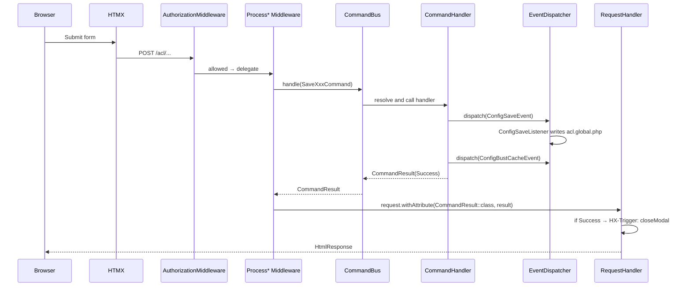
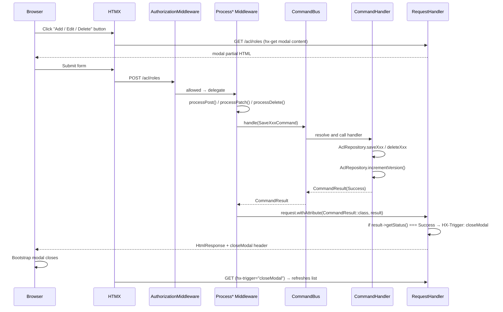
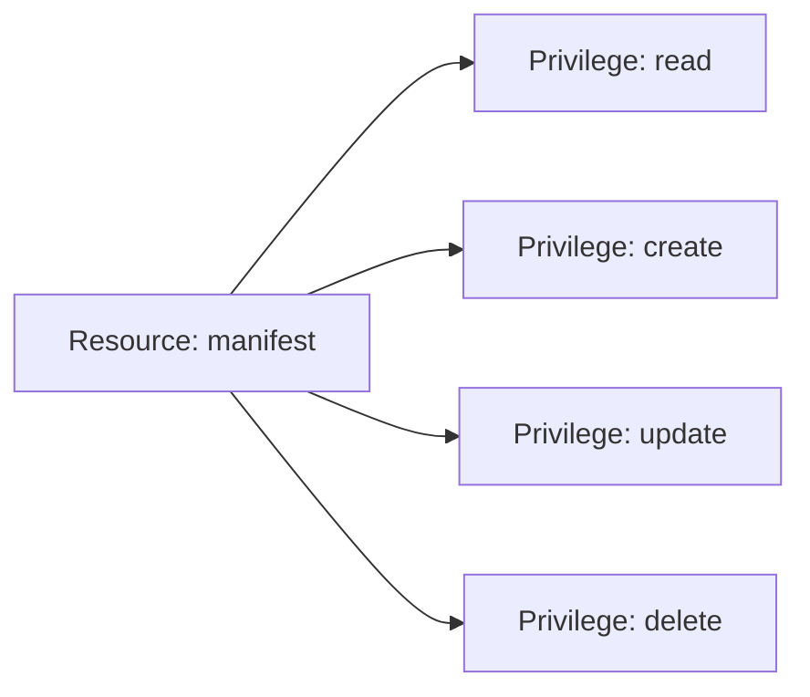
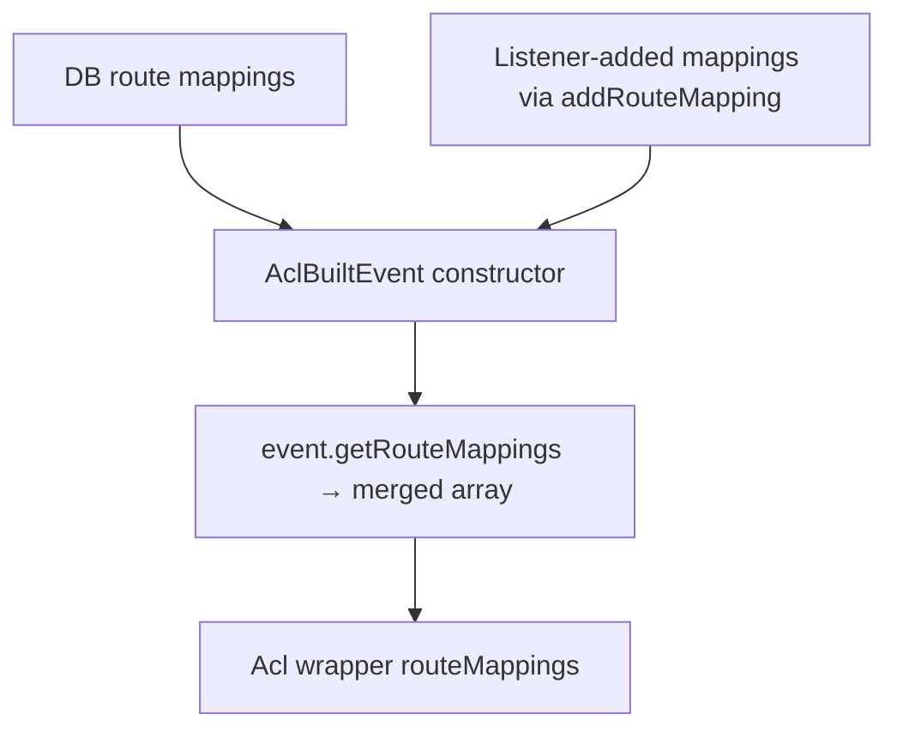

# Admin UI Workflows

The webware-acl Admin UI manages ACL rules via the Protect Route Wizard. The UI
is built with Bootstrap 5 + HTMX and follows the middleware/handler separation
pattern: each write operation is handled by a `Process*Middleware` class; the
downstream `RequestHandler` is render-only.

---

## Access Control for the Admin UI

The `admin.acl` resource is granted exclusively to the **Developer** role.
**Administrators cannot manage the ACL** — this is an immutable rule enforced
by `RegisterAclRulesListener` and intentionally absent from config, preventing
lockout or privilege escalation via the UI.

---

## Architecture: Config-Driven Writes

ACL writes do **not** go through a database repository. The write path is
event-driven and targets `config/autoload/acl.global.php` directly:

```
CommandHandler
    → EventDispatcher::dispatch(ConfigSaveEvent)
        → ConfigSaveListener: merges existing config + updatedConfig
            → ConfigWriter: writes acl.global.php
    → EventDispatcher::dispatch(ConfigBustCacheEvent)
        → CacheBustListener: no-op in debug mode (intentional)
```

The target file is defined by `Configuration::LOCAL_CONFIG_FILE`:

```php
public const string LOCAL_CONFIG_FILE = __DIR__ . '/../../../../config/autoload/acl.global.php';
```

`acl.global.php` is tracked in git. The `.local.php` pattern is gitignored.

---

## Entity Inventory

| Entity | Read Handler | Write Middleware | Command Handler | Status |
|---|---|---|---|---|
| ACL Overview | `AclOverviewHandler` | — | — | ✓ implemented |
| Protect Route Wizard | `RuleManagerHandler` | `ProcessRuleMiddleware` | `SaveRuleHandler` | ✓ implemented |
| Save Role | `RoleListHandler` | `ProcessRoleMiddleware` | `SaveRoleHandler` | @todo stub |
| Delete Role | `RoleListHandler` | `ProcessRoleMiddleware` | `DeleteRoleHandler` | @todo stub |
| Update Rule Type | `RuleManagerHandler` | `ProcessRuleMiddleware` | `UpdateRuleTypeHandler` | @todo stub |

Resource management, assertion management, and route mapping management are not
yet implemented.

---

## Generic CRUD Workflow

Every write follows the same middleware/bus/handler pattern:



---

## Protect Route Wizard

**Route**: `POST /{adminRouteSegment}/rule` → named `acl.manager.rule.create`  
**Pipeline**: `ProcessRuleMiddleware` → `RuleManagerHandler`

The wizard is a 5-step Bootstrap modal rendered as a partial inside
`admin-acl.phtml`. It is the only currently working ACL write path.

### Steps

| Step | Label | Input captured |
|---|---|---|
| 1 | Grant | `grant_mode` (`explicit`/`inherited`), `rule_type` (`allow`/`deny`) |
| 2 | Role | `role_id` (string roleId of the selected role) |
| 3 | Privilege | `privileges[]` (one or more from derived HTTP-method map, plus optional custom) |
| 4 | Assertion | `assertion_fqcn` (FQCN or empty), `assertion_mode` (`none`/`must`/`may`) |
| 5 | Review | Read-only summary before submit |

### POST Body Fields

```
route_name        string   Named Mezzio route (e.g. manifest.upload.store)
grant_mode        string   explicit | inherited
rule_type         string   allow | deny
role_id           string   Role roleId string
privileges[]      string[] One or more privilege names
custom_privilege  string   Optional custom privilege name
assertion_fqcn    string   FQCN of AssertionInterface implementation, or empty
assertion_mode    string   none | must | may
```

### Write Path

`ProcessRuleMiddleware` extracts the POST body and dispatches `SaveRuleCommand`.
`SaveRuleHandler` builds the config fragment and fires the save event:

```php
// SaveRuleHandler::handle()
assert($command instanceof SaveRuleCommand);

$updatedConfig = [
    'resources' => [$command->resourceId => true],
    $command->type => [$command->roleId => [$command->resourceId => $command->assertions]],
];

$saveEvent = new ConfigSaveEvent(
    target:        AclInterface::class,
    targetFile:    Configuration::LOCAL_CONFIG_FILE,
    updatedConfig: $updatedConfig,
);

$this->eventDispatcher->dispatch($saveEvent);

if (! $saveEvent->isPropagationStopped()) {
    $this->eventDispatcher->dispatch(new ConfigBustCacheEvent());
}

return new CommandResult($command, CommandStatus::Success, null);
```

`ConfigSaveListener` merges `$event->updatedConfig` into the existing config
for `AclInterface::class` and writes the result back to `acl.global.php`.

### Role Picker

The wizard's Role step renders a flat list ordered by **Kahn's topological sort**
(`protect-route-wizard.phtml`). This guarantees every parent role appears above
all its children regardless of multiple inheritance.

Depth is computed as `max(depth of any parent) + 1`. The `data-depth` attribute
drives CSS indentation:

```
depth 0 → Guest
depth 1 → Member
depth 2 → Warehouse, Sales, Collections
depth 3 → Warehouse Supervisor, Assistant Manager
depth 4 → Manager
depth 5 → Administrator
depth 6 → Developer
```

The role data source is `config[AclInterface::class]['roles']` assembled in
`BuildAccessControlMiddleware` from the merged config of all `ConfigProvider`
implementations.

---

## Role Management

**Route**: `GET|POST /acl/roles`

`SaveRoleHandler` and `DeleteRoleHandler` are **stub implementations** — they
return `CommandStatus::Success` without writing anything. Config-driven role
save/delete via `ConfigSaveEvent` is planned but not yet implemented.

---

## Handler Pattern

All admin handlers are render-only. They inspect the `CommandResult` attribute
and either close the modal or render the page with fresh data:

```php
public function handle(ServerRequestInterface $request): ResponseInterface
{
    $result = $request->getAttribute(CommandResult::class);

    if ($result instanceof CommandResult && $result->getStatus() === CommandStatus::Success) {
        return new HtmlResponse(
            $this->template->render('acl::role-list', $this->buildViewModel($request)),
            200,
            ['HX-Trigger' => 'closeModal'],
        );
    }

    return new HtmlResponse(
        $this->template->render('acl::role-list', $this->buildViewModel($request)),
    );
}
```

The `HX-Trigger: closeModal` header is read by HTMX on the client. A JavaScript
event listener calls `bootstrap.Modal.getInstance(el).hide()` in response.

---

## Template Conventions

- Each entity has a list template (`acl/role-list.phtml`) and a modal partial
  (`acl/partials/role-modal.phtml`)
- No inline styles (`style="..."`) — use `.ims-*` CSS classes in `public/assets/css/custom.css`
- No hardcoded URLs — always use `$this->url('route.name')`
- Edit and Delete buttons carry `hx-get` / `hx-delete` attributes
- Modal forms POST to the same URL as the list page; `AuthorizationMiddleware`
  checks both the GET and POST route stacks separately

---

## Known Limitations

### Role Picker CSS Depth Cap

The role picker indentation uses fixed CSS attribute-selector rules in
`public/assets/css/custom.css`. The current rules cover depths 0–6:

```css
.ims-acl-role-item[data-depth="1"] .ims-acl-role-item-main { padding-left: 1rem; }
/* ... through depth 6 */
```

If a role hierarchy ever exceeds depth 6, roles at depth 7+ will render with
no indentation (snapping back to root-level alignment). The fix is to append
two additional lines to the block per new depth level:

```css
.ims-acl-role-item[data-depth="7"] .ims-acl-role-item-main { padding-left: 7rem; }
.ims-acl-role-item[data-depth="7"] .ims-acl-role-ancestry { padding-left: 8.4rem; }
```

The formula is: `padding-left: {N}rem` for the main row and `padding-left: {N + 1.4}rem`
for the ancestry subtitle.

### Redundant Administrator Parent

`webware-admin/src/ConfigProvider.php` adds `'Administrator' => ['Member']` to
the ACL roles config. After `array_merge_recursive`, Administrator has two
parents: `Manager` (from `ims-store`) and `Member` (from `webware-admin`).

The `Member` parent is redundant — Administrator already reaches `Member`
through the full chain `Manager → Assistant Manager → Sales/Warehouse/Collections → Member`.
The redundant edge does not affect runtime ACL evaluation (Laminas ACL handles
it correctly) but it does cause Administrator to display "child of: Member, Manager"
in the Protect Route Wizard role picker instead of just "child of: Manager".


---

## Access Control for the Admin UI

The `admin.acl` resource is granted exclusively to the **Developer** role.  
**Administrators cannot manage the ACL** — this is an immutable rule enforced
by `RegisterAclRulesListener` and intentionally absent from the DB, preventing
lockout or privilege escalation via the UI.

---

## Entity Inventory

| Entity | Handler (read) | Middleware (write) | Command Handler |
|---|---|---|---|
| ACL Overview | `AclOverviewHandler` | — | — |
| Roles | `RoleListHandler` | `ProcessRoleMiddleware` | `SaveRoleHandler` / `DeleteRoleHandler` |
| Resources | `ResourceListHandler` | `ProcessResourceMiddleware` | `SaveResourceHandler` / `DeleteResourceHandler` |
| Rules | `RuleManagerHandler` | `ProcessRuleMiddleware` | `SaveRuleHandler` / `UpdateRuleTypeHandler` / `DeleteRuleHandler` |
| Route Mappings | `RouteMapManagerHandler` | `ProcessRouteMappingMiddleware` | `SaveRouteMappingHandler` / `DeleteRouteMappingHandler` |
| Assertions | (inline on Rule Manager page) | `ProcessAssertionMiddleware` | `SaveAssertionHandler` / `DeleteAssertionHandler` |

---

## Generic CRUD Workflow

Every entity follows the same modal-driven pattern:



**Key**: The modal close and list refresh are triggered by the `HX-Trigger:
closeModal` response header set by the handler when `CommandStatus::Success`
is returned by the bus. The HTMX swap target refreshes the surrounding list.

---

## Role Management

**Route**: `GET|POST /acl/roles`

### Listing

`RoleListHandler` renders all roles with their parent chain. Each row has:
- **Edit** button → opens modal pre-filled with the role's current parents
- **Delete** button → opens confirmation modal

### Create / Edit

The middleware validates input and dispatches a typed command to the bus.
The `SaveRoleHandler` performs the write:

```php
// SaveRoleHandler::handle()
assert($command instanceof SaveRoleCommand);
$pk = $this->aclRepository->saveRole($command->roleId, $command->parentPk);
$this->aclRepository->incrementVersion();
return new CommandResult($command, CommandStatus::Success, $pk);
```

Roles have at most **one** parent in the DB schema (the `role_parent` table
may hold multiple rows, but the UI exposes single-parent inheritance). Cycles
are detected at build time by `AclBuilder::addRolesInOrder()`.

### Delete

A role cannot be deleted if any rules reference it. The repository throws an
exception that `ProcessRoleMiddleware` catches and sets a `CommandResult::Failure`
with an error message via `SystemMessengerInterface`.

---

## Resource & Privilege Management

**Route**: `GET|POST /acl/resources`

Resources and privileges are managed on the same page. A resource is a logical
grouping (e.g. `manifest`). Each resource has one or more privileges
(`read`, `create`, `update`, `delete` — always from `Privilege` constants).



New privileges can be added via the Add Privilege modal on the same page.
`ProcessResourceMiddleware` handles both resource and privilege creation.

---

## Rule Manager

**Route**: `GET|POST /acl/rules`

The Rule Manager page is the most complex page in the Admin UI. It manages
the allow/deny matrix across all roles, resources, and privileges.

### Hierarchy View

When both `?resource` and `?privilege` query parameters are set, the handler
switches to hierarchy view:

```
GET /acl/rules?resource=manifest&privilege=read
```

The handler computes `effective_state` for every role in topological order
(ancestors first), propagating inherited allow/deny downward:

| `effective_state` value | Meaning |
|---|---|
| `explicit_allow` | This role has an explicit `allow` rule for the resource+privilege |
| `explicit_deny` | This role has an explicit `deny` rule |
| `inherited_allow` | No explicit rule; parent grants `allow` |
| `inherited_deny` | No explicit rule; parent grants `deny` |
| `none` | No rule anywhere in ancestry |

**Elevation alert**: Displayed when a child role has an `explicit_allow` while
an ancestor has an `explicit_deny` (or vice versa). Alerts the admin that the
child's explicit rule overrides the inherited one.

**Redundancy alert**: Displayed when a role has an explicit rule that matches
what it would inherit — the explicit rule is unnecessary.

### Adding a rule

The middleware dispatches a `SaveRuleCommand` to the bus. `SaveRuleHandler` performs the write:

```php
// SaveRuleHandler::handle()
assert($command instanceof SaveRuleCommand);
$this->aclRepository->saveRule(
    $command->rolePk,
    $command->resourcePk,
    $command->privilegePk,
    $command->type,   // 'allow' | 'deny'
);
$this->aclRepository->incrementVersion();
return new CommandResult($command, CommandStatus::Success, null);
```

### Assertions

Assertions are managed via the **Add Assertion** modal triggered from a rule
row. `ProcessAssertionMiddleware` dispatches a `SaveAssertionCommand` to the
bus. `SaveAssertionHandler` performs the write:

```php
// SaveAssertionHandler::handle()
assert($command instanceof SaveAssertionCommand);
$id = $this->aclRepository->saveRuleAssertion(
    $command->rulePk,
    $command->assertion,   // FQCN of AssertionInterface implementation
    $command->mode,        // 'all' | 'at_least_one'
    $command->sortOrder,
);
$this->aclRepository->incrementVersion();
return new CommandResult($command, CommandStatus::Success, $id);
```

Multiple assertions on a rule are evaluated as an `AssertionAggregate`. The
`mode` and `sort_order` control evaluation strategy and execution order.

---

## Route Mapping Manager

**Route**: `GET|POST /acl/route-mappings`

Maps named routes (from the Mezzio router) to a resource + privilege pair.
Route mappings in the DB are merged with listener-registered mappings at build
time (listeners can extend, not replace, DB mappings).



### Adding a route mapping

The middleware dispatches a `SaveRouteMappingCommand` to the bus.
`SaveRouteMappingHandler` performs the write:

```php
// SaveRouteMappingHandler::handle()
assert($command instanceof SaveRouteMappingCommand);
$this->aclRepository->saveRouteMapping(
    $command->routeName,    // e.g. 'manifest.upload.store'
    $command->resourcePk,
    $command->privilegePk,
);
$this->aclRepository->incrementVersion();
return new CommandResult($command, CommandStatus::Success, null);
```

> **Note**: Route mappings added via the Admin UI persist to the DB and survive
> cache invalidation. Listener-added mappings are re-added on every rebuild.
> If the same route name appears in both, the DB mapping takes precedence.

---

## Version Increment Rule

**Every `CommandHandler` must call `incrementVersion()` after the primary write.**
This is not optional — without it, the cache will not invalidate and other
requests will continue using stale ACL data.

```php
// Required pattern — every CommandHandler::handle()
assert($command instanceof SaveXxxCommand);
$this->aclRepository->saveXxx(...);
$this->aclRepository->incrementVersion();
return new CommandResult($command, CommandStatus::Success, $result);
```

If the repository throws, the exception propagates through the bus to
`Process*Middleware`, which catches it and sets a `CommandResult::Failure`
attribute with a message via `SystemMessengerInterface`.

---

## Handler Pattern

All admin handlers are render-only. They inspect the `CommandResult` attribute
and either close the modal or render the page with fresh data:

```php
public function handle(ServerRequestInterface $request): ResponseInterface
{
    $result = $request->getAttribute(CommandResult::class);

    if ($result instanceof CommandResult && $result->getStatus() === CommandStatus::Success) {
        return new HtmlResponse(
            $this->template->render('acl::role-list', $this->buildViewModel($request)),
            200,
            ['HX-Trigger' => 'closeModal'],
        );
    }

    return new HtmlResponse(
        $this->template->render('acl::role-list', $this->buildViewModel($request)),
    );
}
```

The `HX-Trigger: closeModal` header is read by HTMX on the client. A JavaScript
event listener (in `app.js` or the page's `inlineScript()` block) calls
`bootstrap.Modal.getInstance(el).hide()` in response.

---

## Template Conventions

- Each entity has a list template (`acl/role-list.phtml`) and a modal partial
  (`acl/partials/role-modal.phtml`)
- No inline styles (`style="..."`) — use `.ims-*` CSS classes
- No hardcoded URLs — always use `$this->url('route.name')`
- Edit and Delete buttons carry `hx-get` / `hx-delete` attributes
- Modal forms POST to the same URL as the list page; `AuthorizationMiddleware`
  checks both the GET and POST route stacks separately
