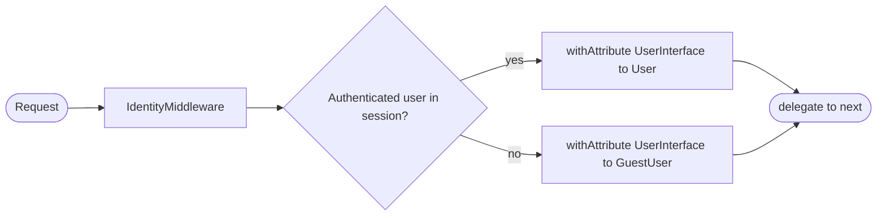
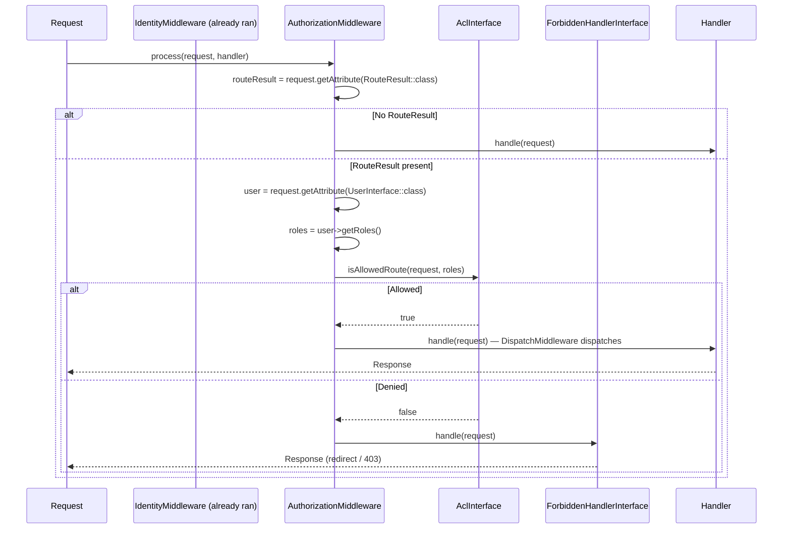
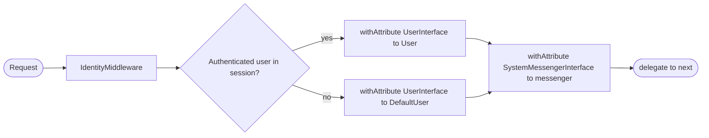
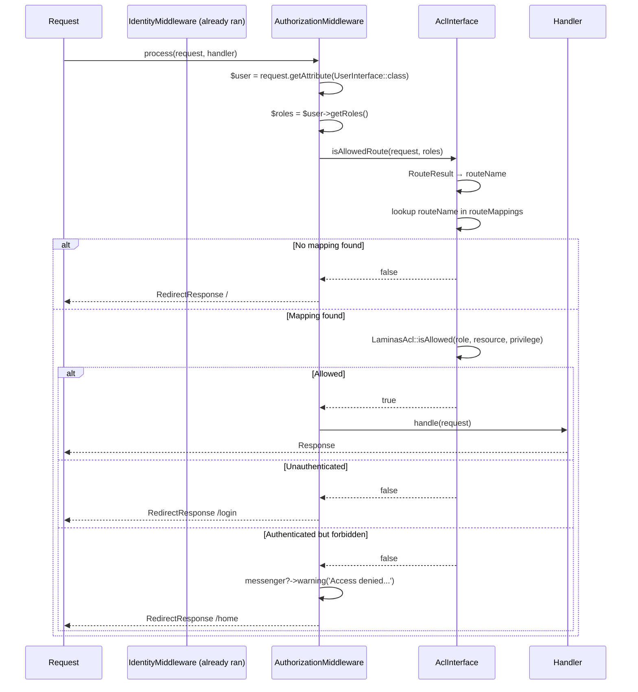

# Authorization Middleware

Two middleware classes make up the per-request access control layer:

- **`IdentityMiddleware`** — runs in the **global pipeline** once per request;
  resolves the authenticated user and attaches it to the request.
- **`AuthorizationMiddleware`** — runs in the **global pipeline before**
  Mezzio's `DispatchMiddleware`; checks `AclInterface::isAllowedRoute()`
  and either passes through to the next middleware or delegates to `ForbiddenHandlerInterface`.

---

## IdentityMiddleware

### Location

`src/Middleware/IdentityMiddleware.php`  
Registered in: `config/pipeline.php` (global; always runs)

### What it does



**`GuestUser`** is a value object that satisfies `UserInterface` with:
- `$roles = ['guest']` (the ACL base role, never granted anything)
- `getOwnerId() → null`
- `isGuest() → true`

### Attributes set

| Attribute key | Value |
|---|---|
| `UserInterface::class` | `User` (logged in) or `GuestUser` (anonymous) |

This attribute is consumed downstream by `AuthorizationMiddleware` and by
handlers that need to know the current user.

> `SystemMessengerInterface` is **not** attached by `IdentityMiddleware`. That
> is the responsibility of `App\Middleware\ImsMessengerMiddleware`, which must
> also be registered in the global pipeline.

---

## AuthorizationMiddleware

### Location

`src/Middleware/AuthorizationMiddleware.php`  
Registered in: **global pipeline, before Mezzio's `DispatchMiddleware`**.

This middleware is not added to individual route stacks. Every request passes
through it once. `DispatchMiddleware` remains in the pipeline and runs after it.

### Constructor dependencies

```php
public function __construct(
    private readonly AclInterface $acl,
    private readonly ForbiddenHandlerInterface $forbiddenHandler,
) {}
```

The user is read from the request attribute set by `IdentityMiddleware`.

### Decision table

| Condition | Action |
|---|---|
| No `RouteResult` on request | **Pass through** — `MethodNotAllowedMiddleware` handles it |
| Route not in ACL mappings | **Deny** → `ForbiddenHandlerInterface::handle($request)` |
| User role(s) are allowed | **Dispatch** → `$routeResult->process($request, $handler)` |
| Any other denial | **Deny** → `ForbiddenHandlerInterface::handle($request)` |

All denial behaviour (redirect paths, toast messages) is owned by the
`ForbiddenHandlerInterface` implementation. The middleware itself has no
hardcoded paths or response logic.

### Sequence diagram



### isAllowedRoute implementation detail

```
isAllowedRoute(request, roles)
  1. Extract RouteResult from request attribute
  2. If RouteResult is null or failure → return false
  3. routeName = RouteResult.getMatchedRouteName()
  4. mapping = routeMappings[routeName] ?? null
  5. If mapping null → return false
  6. For each role in roles:
       if LaminasAcl::isAllowed(role, mapping.resource_id, mapping.privilege_id) → return true
  7. return false
```

Roles are checked in the order returned by `UserInterface::getRoles()`. The first
`true` short-circuits. This means a user with multiple roles is granted access
if **any** role allows it — standard multi-role RBAC semantics.

### isAllowedByRouteName

Used by admin UI handlers to conditionally render action buttons without issuing
a full redirect cycle.

```php
// In a template or handler — check a specific route
$canEdit = $this->acl->isAllowedByRouteName('manifest.upload.store', $user->getRoles());
```

Internally identical to `isAllowedRoute` but accepts the route name string
directly instead of reading from the `RouteResult` attribute.

---

## ForbiddenHandlerInterface

`Webware\Acl\RequestHandler\ForbiddenHandlerInterface` extends
`Psr\Http\Server\RequestHandlerInterface`. The default implementation is
`ForbiddenHandler`, which:

- **Guest** (`isGuest() === true`) → `RedirectResponse($loginPath)`, no toast
- **Authenticated but denied** → optional `SystemMessengerInterface` warning
  toast (only fires if the messenger is present on the request), then
  `RedirectResponse($forbiddenRedirect ?? HTTP_REFERER ?? '/')`

To substitute a custom denial handler, alias `ForbiddenHandlerInterface` in
the host application's DI config:

```php
// config/autoload/acl.local.php
use Webware\Acl\RequestHandler\ForbiddenHandlerInterface;

return [
    'dependencies' => [
        'aliases' => [
            ForbiddenHandlerInterface::class => MyCustomForbiddenHandler::class,
        ],
    ],
];
```

### ForbiddenHandler config keys

All keys live under `AclInterface::class` in the merged config:

| Key | Default | Description |
|---|---|---|
| `login_path` | `'/login'` | Redirect target for guest denials |
| `forbidden_redirect` | `'/'` | Redirect target for authenticated denials; falls back to `HTTP_REFERER` then `'/'` |
| `forbidden_template` | `null` | Reserved — not yet implemented |

---

## Common Mistakes

| Mistake | Consequence |
|---|---|
| Adding `AuthorizationMiddleware` to a route stack instead of global pipeline | Double ACL check; route handler may never be reached |
| Removing `DispatchMiddleware` from the pipeline | Routes are never dispatched after ACL pass |
| Not registering the route in any module's `getAclConfig()` resources array | `isAllowedRoute` is fail-closed → always denied |
| `UserInterface::class` attribute absent from request | `$user?->getRoles()` returns `[]` → every route denied |
| Not placing `IdentityMiddleware` before `AuthorizationMiddleware` in the pipeline | User attribute missing; all routes denied |


---

## IdentityMiddleware

### Location

`src/Middleware/IdentityMiddleware.php`  
Registered in: `config/pipeline.php` (global; always runs)

### What it does



**`DefaultUser`** is a value object that satisfies `UserInterface` with:
- `$roles = ['Guest']` (the ACL base role, never granted anything)
- `$id = 0`
- `isAuthenticated() → false`

### Attributes set

| Attribute key | Value |
|---|---|
| `UserInterface::class` | `User` (logged in) or `DefaultUser` (anonymous) |
| `SystemMessengerInterface::class` | Messenger instance (or `null` when not in HTTP context) |

These attributes are consumed downstream by `AuthorizationMiddleware` and by
handlers that need to know the current user.

---

## AuthorizationMiddleware

### Location

`src/Middleware/AuthorizationMiddleware.php`  
Registered in: **every protected route stack, as the first middleware**.

### Constructor dependencies

```php
public function __construct(
    private readonly AclInterface $acl,
    private readonly RouterInterface $router,
) {}
```

The messenger and user are read from request attributes (set by
`IdentityMiddleware`) — not injected via the constructor.

### Decision table

| Condition | Action |
|---|---|
| Route has no ACL mapping | **Deny** → redirect to `/` (treat unmapped as denied) |
| User has no roles | **Deny** → redirect to `/login` |
| User role(s) are allowed | **Delegate** → `$handler->handle($request)` |
| User is unauthenticated (`DefaultUser`) | **Deny** → `RedirectResponse('/login')` |
| Authenticated but forbidden | **Deny** → messenger warning + `RedirectResponse('/home')` |

### Sequence diagram



### isAllowedRoute implementation detail

```
isAllowedRoute(request, roles)
  1. Extract RouteResult from request attribute
  2. If RouteResult is null or failure → return false
  3. routeName = RouteResult.getMatchedRouteName()
  4. mapping = routeMappings[routeName] ?? null
  5. If mapping null → return false
  6. For each role in roles:
       if LaminasAcl::isAllowed(role, mapping.resource_id, mapping.privilege_id) → return true
  7. return false
```

Roles are checked in the order returned by `UserInterface::getRoles()`. The first
`true` short-circuits. This means a user with multiple roles is granted access
if **any** role allows it — standard multi-role RBAC semantics.

### isAllowedByRouteName

Used by admin UI handlers to conditionally render action buttons without issuing
a full redirect cycle.

```php
// In a template or handler — check a specific route
$canEdit = $this->acl->isAllowedByRouteName('manifest.upload.store', $user->getRoles());
```

Internally identical to `isAllowedRoute` but accepts the route name string
directly instead of reading from the `RouteResult` attribute.

---

## Route Stack Registration

```php
// RouteProvider.php — every protected route
$app->route(
    '/manifests/upload',
    [
        AuthorizationMiddleware::class,   // ← always first
        ManifestUploadHandler::class,
    ],
    ['GET'],
    'manifest.upload'
);

$app->route(
    '/manifests/upload',
    [
        AuthorizationMiddleware::class,
        ProcessManifestUploadMiddleware::class,
        ManifestUploadHandler::class,
    ],
    ['POST'],
    'manifest.upload.store'
);
```

> `AuthorizationMiddleware` must always be the **first** middleware in a
> protected route stack, after `IdentityMiddleware` has already run in the
> global pipeline.

---

## Event Logging

`AuthorizationMiddleware` dispatches a `LogEvent` on every denied request.
The event carries the route name, user ID, and user roles, enabling audit
logging without hard-coupling the middleware to a logger.

```php
$this->events->dispatch(new LogEvent(
    level: LogLevel::WARNING,
    message: 'Access denied',
    context: ['route' => $routeName, 'user' => $user->getId(), 'roles' => $roles],
));
```

---

## Common Mistakes

| Mistake | Consequence |
|---|---|
| Omitting `AuthorizationMiddleware` from a route stack | Route is publicly accessible with no ACL check |
| Placing `AuthorizationMiddleware` after write middleware | Write runs before access is verified |
| Not registering the route in `RegisterXxxRouteMappingsListener` | Route maps to no resource → always denied |
| Using string role names instead of role objects | Laminas Acl receives an unknown role → throws `InvalidArgumentException` |
| Not calling `IdentityMiddleware` in the global pipeline | `UserInterface::class` attribute is null → `AuthorizationMiddleware` throws |
